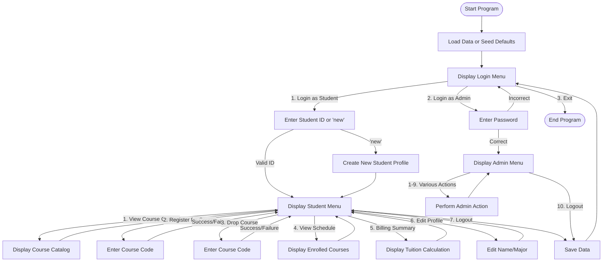

# Course Enrollment System

This is a Java-based Course Enrollment System that allows students to register for courses and administrators to manage the system.

## Use Case Diagram

```mermaid
graph TD
    Student[Student Actor] -->|Login| LoginStudent[Login as Student]
    Student -->|Create| CreateProfile[Create New Student Profile]
    Student -->|View| ViewCatalog[View Course Catalog]
    Student -->|Register| RegisterCourse[Register for Course]
    Student -->|Drop| DropCourse[Drop Course]
    Student -->|View| ViewSchedule[View My Schedule]
    Student -->|View| BillingSummary[Billing Summary]
    Student -->|Edit| EditProfile[Edit My Profile]
    Student -->|Logout| LogoutStudent[Logout and Save]

    Admin[Admin Actor] -->|Login| LoginAdmin[Login as Admin]
    Admin -->|View| ViewCatalogAdmin[View Course Catalog]
    Admin -->|View| ViewRoster[View Class Roster]
    Admin -->|View| ViewStudents[View All Students]
    Admin -->|Add| AddStudent[Add New Student]
    Admin -->|Edit| EditStudent[Edit Student Profile]
    Admin -->|Add| AddCourse[Add New Course]
    Admin -->|Edit| EditCourse[Edit Course]
    Admin -->|View| ViewStudentSchedule[View Student Schedule]
    Admin -->|View| AdminBilling[Billing Summary for Student]
    Admin -->|Logout| LogoutAdmin[Logout and Save]

    System[System] -->|Load| LoadData[Load Data on Startup]
    System -->|Save| SaveData[Save Data on Exit]
    System -->|Seed| SeedData[Seed Default Data if First Run]
```

## Flowchart of the main workflow

## Python Implementation

A Python version of the "Register for Course" use case has been implemented in the `python/` folder. See `python/README.md` for details.

## Prompts

The following prompts were used to help create the Python implementation:

1. "Convert this Java Course class to Python"
2. "Convert this Java Student class to Python"  
3. "Convert this Java TimeSlot class to Python"
4. "Convert this Java EnrollmentSystem class to Python, focusing on the register_course method"
5. "Create a Python DataManager class equivalent to the Java version using json instead of Gson"
6. "Create a simple Python CLI script that demonstrates the register course functionality"
